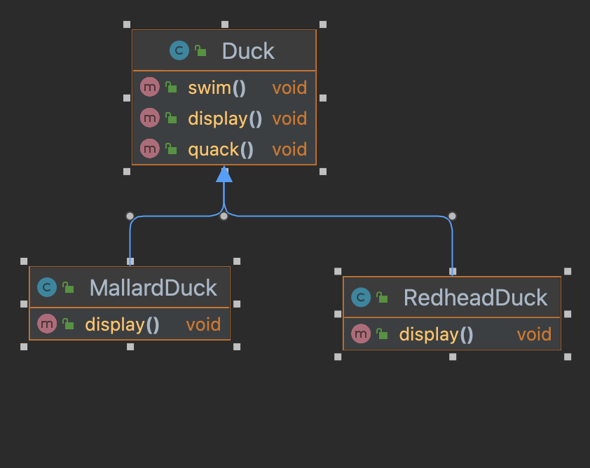
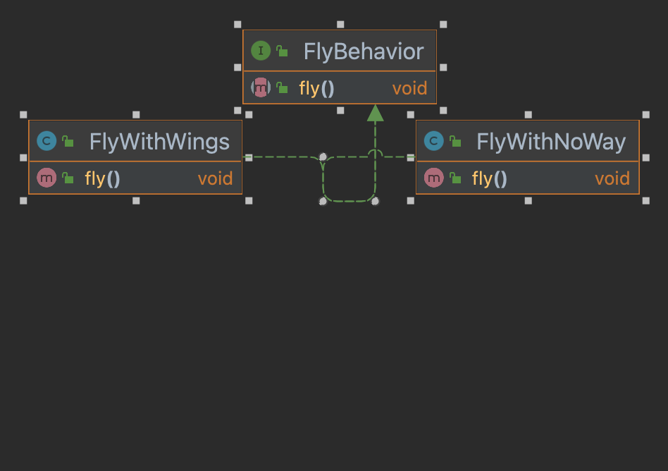

# 1.《设计模式入门》

## 需求
> 设计一个鸭子相关的应用，有不同鸭子，会叫、游泳等。目前需要对鸭子加一个飞的方法

## 最初设计


## 设计发展

### a. 在Duck类中添加fly方法

缺陷：所有鸭子都会飞了，包括橡皮鸭等不会飞的鸭子

### b. 覆盖fly方法

缺陷：假如以后有诱饵鸭等不会飞也不会叫的鸭子，还需要覆盖quack方法

### c. 将fly、quack等方法从父类中抽取出来，做成接口，如flyable、quackable等

缺陷：无法做到代码父类，假如有几十个鸭子类，每个接口需要实现几十个方法

### d. 把经常变化的抽离出来，与不变化的分离

将fly和quack分离，分别建立两组新类



具体实现：

在超类中添加实例变量，通过调用该实例变量实现fly方法
```java
public class Duck {
    protected FlyBehavior flyBehavior;

    public void swim() {
        System.out.println("鸭子游泳");
    }

    public void display() {
        System.out.println("鸭子外表");
    }
    
    public void performFly() {
        flyBehavior.fly();
    }
}

public class MallardDuck extends Duck {

    public MallardDuck() {
        flyBehavior = new FlyWithWings();
    }

    @Override
    public void display() {
        System.out.println("绿头鸭外表");
    }

}
```

假如需要动态设定鸭子的行为，可以在Duck超类中添加设置behavior方法
```java
public class Duck {
    protected FlyBehavior flyBehavior;

    // ...
    public void setFlyBehavior(FlyBehavior flyBehavior) {
        this.flyBehavior = flyBehavior;
    }
    
}
```
## 总结：
1. 封装变化
2. 多用组合，少用继承
3. 针对接口编程，不针对实现编程

第一个设计模式：策略模式
> 策略模式定义了算法簇，分别封装起来，它们之间可以替换，让算法的变化独立于使用算法的客户

