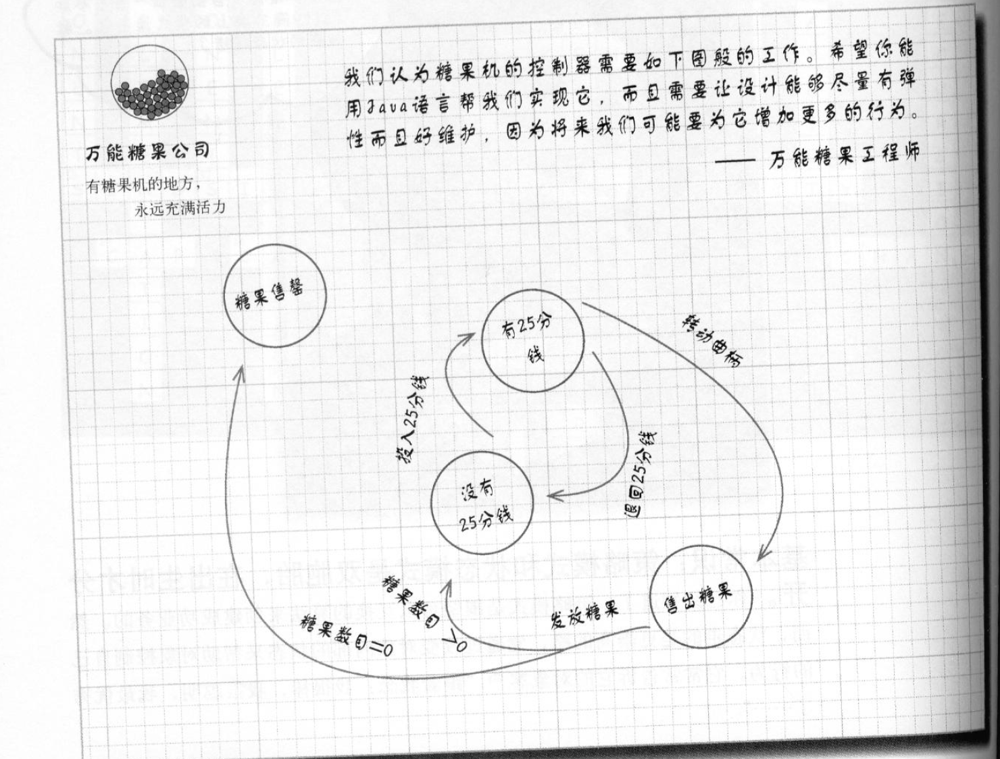

# 《状态模式》

## 需求
实现一个糖果机，该糖果机状态有如下变化：


## 状态机分析
1. 找出所有状态：a.没有25分钱 b.有25分钱 c.糖果告罄 d. 售出糖果
2. 创建实例维持当前状态
```java
public class StateConstant {
    public final static int SOLD_OUT = 0;
    public final static int NO_QUARTER = 1;
    public final static int HAS_QUARTER = 2;
    public final static int SOLD = 3;
}
```
3. 动作： a.投入25分钱 b.退回25分钱 c.转动曲柄 d.发放糖果

例：投币后根据状态相应动作
```java
public class SugarState {
    private int state;
    public void insertQuarter() {
        if (state == StateConstant.HAS_QUARTER) {
            System.out.println("已投币，不需要再投币");
        } else if (state == StateConstant.SOLD_OUT) {
            System.out.println("糖果卖完了，不能投币");
        } else if (state == StateConstant.SOLD) {
            System.out.println("已经给糖果了");
        } else if (state == StateConstant.NO_QUARTER) {
            System.out.println("投币成功");
        }
    }
}
```

## 初始糖果机实现
```java
public class SugarMachine {
    public final static int SOLD_OUT = 0;
    public final static int NO_QUARTER = 1;
    public final static int HAS_QUARTER = 2;
    public final static int SOLD = 3;

    private int state = SOLD_OUT;
    private int count = 0;

    public SugarMachine(int count) {
        this.count = count;
        if (count > 0) {
            state = NO_QUARTER;
        }
    }

    public void insertQuarter() {
        if (state == HAS_QUARTER) {
            System.out.println("已投币，不需要再投币");
        } else if (state == SOLD_OUT) {
            System.out.println("糖果卖完了，不能投币");
        } else if (state == SOLD) {
            System.out.println("已经给糖果了");
        } else if (state == NO_QUARTER) {
            state = HAS_QUARTER;
            System.out.println("投币成功");
        }
    }

    public void ejectQuarter() {
        if (state == HAS_QUARTER) {
            state = NO_QUARTER;
            System.out.println("返回金额");
        } else if (state == SOLD_OUT) {
            System.out.println("无法返还金额");
        } else if (state == SOLD) {
            System.out.println("你已经得到糖果");
        } else if (state == NO_QUARTER) {
            System.out.println("你还未投币");
        }
    }

    public void turnCrank() {
        if (state == HAS_QUARTER) {
            state = SOLD;
            System.out.println("得到糖果");
            dispense();
        } else if (state == SOLD_OUT) {
            System.out.println("没有糖果");
        } else if (state == SOLD) {
            System.out.println("你已经得到糖果");
        } else if (state == NO_QUARTER) {
            System.out.println("你还未投币");
        }
    }

    private void dispense() {
        if (state == SOLD) {
            System.out.println("正在售出糖果");
            count--;
            if (count == 0) {
                state = SOLD_OUT;
            } else {
                state = NO_QUARTER;
            }
        } else if (state == SOLD_OUT) {
            System.out.println("没有糖果");
        } else if (state == NO_QUARTER) {
            System.out.println("请先付款");
        } else if (state == HAS_QUARTER) {
            System.out.println("没有该状态");
        }
    }
}
```

## 新需求
> 需要添加一个赢家状态，有10%的几率为赢家，可以得到双倍糖果。
> 需要在之前所有改变状态的方法中处理赢家状态

## 使用状态模式
1. 定义State接口，糖果机的每个动作都有一个对应方法
2. 为每个状态实现一个状态类。在对应状态下进行机器的行为
3. 将动作委托给状态类

糖果机
```java
@Data
public class StateSugarMachine {
    private SoldState soldState;
    private SoldOutState soldOutState;
    private NoQuarterState noQuarterState;
    private HasQuarterState hasQuarterState;
    private State state;
    private int count = 0;

    public StateSugarMachine(int count) {
        soldState = new SoldState(this);
        soldOutState = new SoldOutState(this);
        noQuarterState = new NoQuarterState(this);
        hasQuarterState = new HasQuarterState(this);
        if (count > 0) {
            state = noQuarterState;
        } else {
            state = soldOutState;
        }
    }

    public void insertQuarter() {
        state.insertQuarter();
    }

    public void ejectQuarter() {
        state.ejectQuarter();
    }

    public void turnCrank() {
        state.turnCrank();
    }

    public void setState(State state) {
        this.state = state;
    }

    public void releaseBall() {
        System.out.println("开始发放糖果");
        if (count != 0) {
            count--;
        }
    }
    
}
```

相关状态类
```java
public class HasQuarterState implements State{
    private StateSugarMachine stateSugarMachine;
    public HasQuarterState(StateSugarMachine stateSugarMachine) {
        this.stateSugarMachine = stateSugarMachine;
    }
    @Override
    public void insertQuarter() {
        System.out.println("已投币");
    }

    @Override
    public void ejectQuarter() {
        System.out.println("返还投币");
        stateSugarMachine.setState(stateSugarMachine.getNoQuarterState());
    }

    @Override
    public void turnCrank() {
        System.out.println("开始给糖果");
        stateSugarMachine.setState(stateSugarMachine.getSoldState());
    }

    @Override
    public void dispense() {
        System.out.println("先拉杆");
    }
}

public class NoQuarterState implements State{
    private StateSugarMachine stateSugarMachine;
    public NoQuarterState(StateSugarMachine stateSugarMachine) {
        this.stateSugarMachine = stateSugarMachine;
    }
    @Override
    public void insertQuarter() {
        System.out.println("已投币");
        stateSugarMachine.setState(stateSugarMachine.getHasQuarterState());
    }

    @Override
    public void ejectQuarter() {
        System.out.println("还未投币");
    }

    @Override
    public void turnCrank() {
        System.out.println("还未投币");
    }

    @Override
    public void dispense() {
        System.out.println("还未投币");
    }
}

public class SoldState implements State{
    private StateSugarMachine stateSugarMachine;
    public SoldState(StateSugarMachine stateSugarMachine) {
        this.stateSugarMachine = stateSugarMachine;
    }
    @Override
    public void insertQuarter() {
        System.out.println("正在给糖果");
    }

    @Override
    public void ejectQuarter() {
        System.out.println("已给糖果");
    }

    @Override
    public void turnCrank() {
        System.out.println("正在给糖果");
    }

    @Override
    public void dispense() {
        stateSugarMachine.releaseBall();
        if (stateSugarMachine.getCount() > 0) {
            stateSugarMachine.setState(stateSugarMachine.getNoQuarterState());
        } else {
            System.out.println("糖果已卖完");
            stateSugarMachine.setState(stateSugarMachine.getSoldOutState());
        }
    }
}

public class SoldState implements State{
    private StateSugarMachine stateSugarMachine;
    public SoldState(StateSugarMachine stateSugarMachine) {
        this.stateSugarMachine = stateSugarMachine;
    }
    @Override
    public void insertQuarter() {
        System.out.println("正在给糖果");
    }

    @Override
    public void ejectQuarter() {
        System.out.println("已给糖果");
    }

    @Override
    public void turnCrank() {
        System.out.println("正在给糖果");
    }

    @Override
    public void dispense() {
        System.out.println("发放糖果");
    }
}
```

新加winner需求
```java
public class WinnerState implements State{
    private StateSugarMachine stateSugarMachine;
    public WinnerState(StateSugarMachine stateSugarMachine) {
        this.stateSugarMachine = stateSugarMachine;
    }
    @Override
    public void insertQuarter() {
        System.out.println("操作错误");
    }

    @Override
    public void ejectQuarter() {
        System.out.println("操作错误");
    }

    @Override
    public void turnCrank() {
        System.out.println("操作错误");
    }

    @Override
    public void dispense() {
        System.out.println("获得双倍糖果");
        stateSugarMachine.releaseBall();
        if (stateSugarMachine.getCount() == 0) {
            stateSugarMachine.setState(stateSugarMachine.getSoldOutState());
        } else {
            stateSugarMachine.releaseBall();
            if (stateSugarMachine.getCount() > 0) {
                stateSugarMachine.setState(stateSugarMachine.getNoQuarterState());
            } else {
                stateSugarMachine.setState(stateSugarMachine.getSoldOutState());
            }
        }
    }
}
```

## 与策略模式对比
状态模式通过自身维持的状态来进行对应状态变化

策略模式通过外部修改策略，选择对应策略