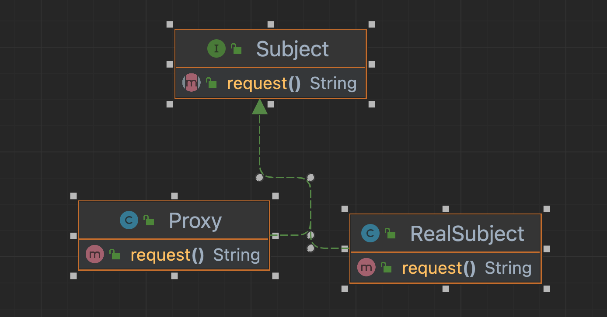

# 《代理模式》
> 代理模式为另一个对象提供一个替身或占位符以控制对这个对象的访问



## 虚拟代理
> 虚拟代理是大开销对象的代表，当该对象在创建前或创建中时用来代替真正对象，创建后委托给真正对象

## 需求
> 在下载图片时利用代理对象先返回正在加载中，下载完成显示图像
> 

## 实现
```java
public class ImageProxy {
    private ImageIcon imageIcon;
    private URL imageURL;
    private Thread retrievalThread;
    private boolean retrieving = false;

    public ImageProxy(URL url) {
        imageURL = url;
    }

    public int getIconWidth() {
        if (imageIcon != null) {
            return imageIcon.getIconWidth();
        } else {
            return 800;
        }
    }

    public int getIconHeight() {
        if (imageIcon != null) {
            return imageIcon.getIconHeight();
        } else {
            return 600;
        }
    }

    public void paintIcon(Component c, Graphics g, int x, int y) {
        if (imageIcon != null) {
            imageIcon.paintIcon(c, g, x, y);
        } else {
            g.drawString("加载图像中", x + 300, y + 190);
            if (!retrieving) {
                retrieving = true;
                new Thread(() -> {
                    try {
                        imageIcon = new ImageIcon(imageURL, "CD Cover");
                        c.repaint();
                    } catch (Exception e) {
                        e.printStackTrace();
                    }
                }).start();
            }
        }
    }
}

```

## JDK动态代理
> 设计一个约会系统，可以设置自己信息，别人也可以设置评分

## 初始设计
```java
public interface PersonBean {
    String getName();
    String getGender();
    String getInterests();
    double getHostOrNotRating();

    void setName(String name);
    void setGender(String gender);
    void setInterests(String interests);
    void setHostOrNotRating(int rating);
}

public class PersonBeanImpl implements PersonBean{
    private String name;
    private String gender;
    private String interests;
    private int rating;
    private int ratingCount = 0;
    @Override
    public String getName() {
        return name;
    }

    @Override
    public String getGender() {
        return gender;
    }

    @Override
    public String getInterests() {
        return interests;
    }

    @Override
    public double getHostOrNotRating() {
        if (ratingCount == 0) {
            return 0;
        }
        return rating * 1.0 / ratingCount;
    }

    @Override
    public void setName(String name) {
        this.name = name;
    }

    @Override
    public void setGender(String gender) {
        this.gender = gender;
    }

    @Override
    public void setInterests(String interests) {
        this.interests = interests;
    }

    @Override
    public void setHostOrNotRating(int rating) {
        this.rating += rating;
        ratingCount++;
    }
}
```

缺陷：
别人可以纂改自己的信息，而且自己可以给自己评分

解决：
使用保护代理，该代理可以控制客户对对象的访问权限

## jdk动态代理实现
1. 实现 InvocationHandler
```java
public class OwnerInvocationHandler implements InvocationHandler {
    private PersonBean person;

    public OwnerInvocationHandler(PersonBean person) {
        this.person = person;
    }

    @Override
    public Object invoke(Object proxy, Method method, Object[] args) throws Throwable {
        try {
            if (method.getName().startsWith("get")) {
                return method.invoke(person, args);
            } else if (method.getName().equals("setHotOrNotRating")) {
                throw new IllegalAccessException();
            } else if (method.getName().startsWith("set")) {
                return method.invoke(person, args);
            }
        } catch (InvocationTargetException e) {
            e.printStackTrace();
        }
        return null;
    }
}
```

2. 创建并实例化Proxy对象
```java
public class OwnerProxyUtil {
    public static PersonBean getOwnerProxy(PersonBean person) {
        return (PersonBean) Proxy.newProxyInstance(
                person.getClass().getClassLoader(),
                person.getClass().getInterfaces(),
                new OwnerInvocationHandler(person)
        );
    }
}
```

## 动态代理总结
1. 运行时创建类
2. 可以通过isProxyClass()方法判断是否代理类
3. 创建代理类时必须传入接口